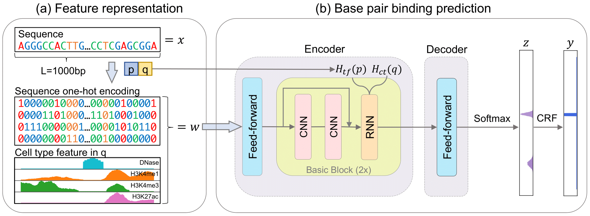

# NetTIME

<p align="left">
    <a href="https://github.com/ryi06/NetTIME/releases">
        
    </a>
    <a href="https://zenodo.org/badge/latestdoi/357427063"></a>
</p>

A multitask and base-pair resolution framework for predicting cell-type specific transcription factor binding sites.
<p align="center"></p>

## Citation
If you use NetTIME in your research, please cite:
```
@article{yi2021nettime,
  title={{NetTIME}: Improving Multitask Transcription Factor Binding Site Prediction with Base-pair Resolution},
  author={Yi, Ren and Cho, Kyunghyun and Bonneau, Richard},
  journal={bioRxiv},
  year={2021},
  publisher={Cold Spring Harbor Laboratory}
}
```


## Installation

Run the following commands to clone the repository and install NetTIME:
```bash
git clone https://github.com/ryi06/NetTIME.git
cd NetTIME

# Create a Conda environment with Python 3.6 and install required packages
conda env create --file environment.yml
conda activate nettime
```
Please refer to [Pytorch documentation](https://pytorch.org/) for instructions on setting up CUDA.

## Making predictions using a trained NetTIME model

We use `NetTIME_predict.py` to make predictions from a trained NetTIME model. Pretrained NetTIME models can be found [here](pretrained/). We use an [example prediction dataset](data/datasets/prediction_example/) to demonstrate how to make predictions using trained NetTIME models. Check out [this tutorial](preprocess/README.md#generating-data-to-make-predictions-from-a-trained-model) on how to generate datasets like this.

Making binding probability predictions for  JUN.K562 and JUNB.GM12878 from a trained NetTIME model can be achieved by running the following. See `NetTIME_predict.py -h` for all available arguments. 
```bash
python NetTIME_predict.py \
--batch_size 2700 \
--num_workers 10 \
--dataset "data/datasets/prediction_example/predict.h5" \
--dtype "prediction" \
--index_file "data/embeddings/pretrained.pkl" \
--experiment_name "prediction_example" \
--model_config "pretrained/seqCT/seqCT.config" \
--best_ckpt "pretrained/seqCT/seqCT_433000.ckpt" \
--eval_metric "aupr" \
--no_target \
--predict_groups "JUN.K562" "JUNB.GM12878"
```
Binding probability predictions will be saved in `experiments/prediction_example/prediction_predict`. If you wish to further perform binary classification on the predicted binding probabilities using a pretrained conditional random field (CRF) classifier, run `NetTIME_CRF_predict.py` as follows:
```bash
python NetTIME_CRF_predict.py \
--batch_size 2700 \
--num_workers 10 \
--prediction_dir "experiments/prediction_example/prediction_predict" \
--experiment_name "prediction_example" \
--dtype "prediction" \
--model_config "pretrained/seqCT/seqCT_crf.config" \
--best_ckpt "pretrained/seqCT/seqCT_crf_250000.ckpt"
```
Binary binding classification will be saved in `experiments/prediction_example/prediction_crf_predict`.

## Training a NetTIME model

A tutorial on how to train a NetTIME model using [example training data](data/datasets/training_example/) can be found in [training_example.md](training_example.md).

## Dataset

Instructions for downloading datasets used to generate main results in the manuscript can be found [here](data/datasets/README.md).
